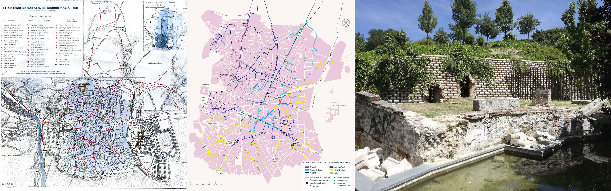
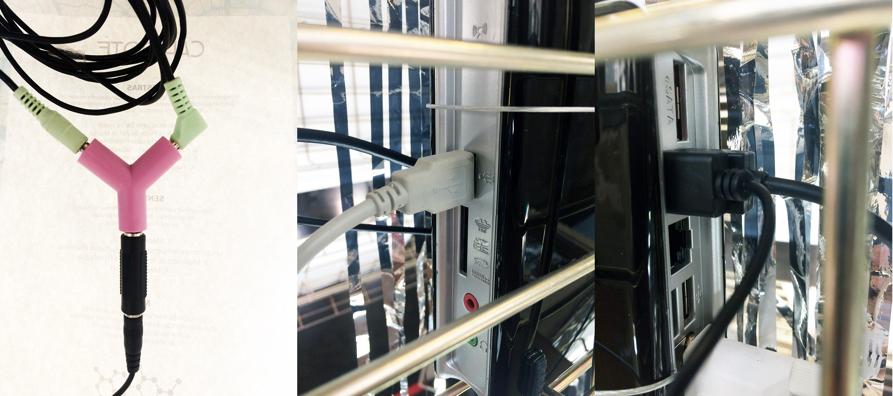

# Interactivos17 - Viajes de agua
- [Descripción del proyecto](#descripción-del-proyecto)
- [Diario del proceso](#diario-del-proceso)
- [Instrucciones](#instrucciones)
- [Recursos](#recursos)
- [Equipo](#equipo)

# Descripción del proyecto

Viajes de agua es un proyecto artístico de investigación sobre la creación de una nueva noción de paseo y de viaje. Para seguir el recorrido de las agua subterráneas, en nuestra investigación nos centramos en la experiencia: explorando el espacio mediante la reinterpretación de la cartografía científica e histórica de Madrid. Caminamos sobre trayectorias marcadas por las viejas canalizaciones de arroyos y generamos un mapa psicogeográfico propio a través del sonido con el que jugar a la búsqueda de lo que fluye oculto "bajo los adoquines" y el asfalto. En el proceso encontramos un presente formado por capas superpuestas de tiempo, cargado de imaginarios sobre la ciudad, que tratamos de (de)construir mediante la performatividad. 

### Idea

Para proponer una noción de viaje y de paseo diferente, en este proyecto se tratará de realizar derivas urbanas en busca del agua subterránea. Del estudio de la cartografía científica e histórica de Madrid, imaginamos un dispositivo que nos permita reinterpretar la ciudad. Estudiar el comportamiento de la naturaleza ajeno a los efectos de las corrientes humanas y sus construcciones, para dejarse llevar durante un tiempo aunque es evidente que el paso será interrumpido y las interferencias múltiples. 

Sin embargo, de la exploración del espacio y la construcción de un nuevo mapa psicogeográfico, el sujeto tomará un giro imprevisto que le haga partícipe en este juego. Caminar juntas. Guiarnos a través de mensajes acuáticos. Por debajo de lo visible, el fluir del agua que en su propia deriva esconde otras nociones de recorrer la ciudad para dar lugar a un nuevo ritual que nos hará descubrir lo oculto, lo olvidado. 

"Bajo los adoquines, la playa", la que buscaban los revolucionarios franceses en mayo del 68, encarna el mensaje de una forma sutil que lucha contra lo establecido. En esta idea se condensa la visión inicial de nuestra propuesta que pone el punto de partida en un procedimiento situacionista, como técnica de experimentación. Una idea abierta a partir de la cuál incorporar nuevos conocimientos sobre la investigación biológica, la performatividad y la construcción de nuevos imaginarios.

Desde esa perspectiva, el juego se convirtió en experiencia ritual, cuyo maestro de ceremonias sería la figura actualizada del "aguador" que nos reuniría en torno a fuentes "fantasmas" que ya no existen en la actualidad, para recuperar historias olvidadas como los milagros de San Isidro "zahorí". Para realizar este particular “viaje de agua” por la superficie de la ciudad, redefinimos nuestro dispositivo como objeto ritual en forma de laboratorio portátil con geolocalización amplificada. Un experimento participativo en su conjunto, que no tiene otro objetivo que servir de llamamiento al agua y, al mismo tiempo, a la atención de los ciudadanos, para compartir la visión lúdica, constructiva y sonora de este proyecto. 

Aunque aquí no hay playa, la historia de la ciudad que "sobre agua [fue] edificada" está unida a su origen. Madrid debe su nombre a un asentamiento árabe "Magrit", que significa cauce, que antes fue uno visigodo "Matrice" y cuyo significado es arroyo. De su memoria también recuperamos para el título del proyecto, Viajes de agua, el nombre dado al conjunto de conducciones subterráneas que canalizaban el agua de diferentes acuíferos del terreno ocupado por la ciudad en la época medieval.

### Implementación del proyecto
Explicación de cómo se ha hecho: materiales, procesos, conexiones, etc. 
(Nota: los textos explicativos han de ser claros y suficientes para que otra persona pudiera retomar este proyecto)
paso 1
paso 2 
paso 3

# Diario del proceso
Investigaciones previas y mapas de partida:

**Viernes 19.** Se va conformando el equipo. Con la primera sesión crítica, aparecen las primeras dudas. Por recomendación de los mentores salimos a la deriva por el parque del Retiro. Buscamos inspiración en el "Huerto del Retiro" y la antigua noria. Imaginamos los primeros prototipos.

**Sábado 20.** Manos a la obra. Conceptualización del proyecto: estudio de cartografía georeferenciada, laboratorio portátil de Hamilton, zona de estudio acotada. Creamos nuestro diario visual en Instagram.

**Lunes 22.** Creamos una lista en spotify. Primer esquema de mapa. 

**Martes 23.** Primer experimento: simulación sonora en la calle. Let's fake it. Mayrit.

**Miércoles 24.** Viaje de agua por la calle Santa Isabel, Plaza de Antón Martín, calle de Santa Ana y Plaza de Lavapiés.

**Jueves 25.** Presentación del estado del proyecto. Segunda sesión crítica. Probando la app de Mario por primera vez por el camino, algunas fuentes olvidadas.

**Viernes 26.** Primeras pruebas del prototipo. 

**Sábado 27.** bla, bla, bla

**Domingo 28.** Nuevos mapas. Pruebas de app con la tablet.

**Lunes 29.** Nueva versión del prototipo: "Capirote" en cartón.

**Martes 30.** Recorridos por fuentes y recogida de muestras de agua.

**Miércoles 31.** Último día. Montaje del prototipo y prueba en directo durante la presentación final del proyecto.

# Instrucciones
### Montaje y desmontaje

 
 
 Materiales de exposición:
 - Cartel informativo: A3 a color
 - Mapa: A3 impreso a color por ambas caras
 - Instrucciones: A4 a color
 - Video: duración: 3 min. en bucle reproducido en pantalla de ordenador
 - CPU: reproductor de video y alimentador USB
 - Capitore: Dispositivo que contiene altavoces, tablet, arduino y botes con muestras de agua.
 
Ensamblaje:
 - El dispositivo se conecta mediante 3 USB a la CPU que actua como alimentador.
 - Los altaves van conectados a la tablet y ardunino.
 - Todos los elementos tecnológicos van contenidos y protegidos en una caja de madera y los altavoces insertos en una pirámide de madera. Para evitar la caída del dispositivo se recomienda sujetarlo a la balda expositora mediante hilo transparente.
 
 
 
### Funcionamiento
Encendido:
- Altavoces: Van interconectados a la tablet y el arduido y reproducen simultáneamente sonidos de ambos dispositivos.
- Tablet: Encender la tablet y activar la página web o aplicicación. En el escritorio hay accesos directos. 
Es necesaria una conexión wifi para la lectura de datos.
- Arduino: ???

Interacción:
- Documentación: Videos, mapas e información del proyecto.
- Tablet: El usuario podrá navegar por la web del proyecto visionando mapas, fotos y videos.
- Arduino: El usuario podrá medir los diferentes parámetros del agua contenida en los tubos de ensayo. Para ello tendrá que introducir el sensor negro en los diferentes tubos con agua y en la pantalla LCD del arduino aparecerán los valores. Apartir de estos valores el sonido que emiten los altavoces variará ligeramente. También se puede interactuar con el botón negro del arduino, girándolo aparecerán los distintos valores de medición que se realizan: PH, humedad y gases.

### Mantenimiento
- Encender la CPU, pantalla y tablet.
- Ver que la tablet tenga conexión wifi.
- Ver que los sensores de humedad y demás están mostrando sus datos en la pantalla LCD.
- Ver que el altavoz esté conectado, en modo LINEIN, y con volumen bajo para no molestar. 
- Si deja de fucncionar cuál sería la lista de errores más corrientes / comunes: Ver que que el cable de audio sigue bien conectado.

# Recursos
### código
+ arduino
### diseño
+ Fablab: fabricación del prototipo

+ Mapas: desarrollo del mapa a partir del estudio de la cartografía hidrogeológica e histórica de Madrid

### Repositorios del proyecto
+ Diario visual del proyecto en instagram: https://www.instagram.com/viajesdeagua/
+ Link a documentación y material gráfico el Google Drive: https://drive.google.com/drive/folders/0B9ZUP7obaQuuMm5DX1VUa2o0UzQ?usp=sharing
+ Link a videos: https://www.youtube.com/channel/UC9-pilYvurbdk7dpdbFdIiA

### Referencias
+ "Teoría de la deriva" de Guy Debord. 1958 https://www.sindominio.net/ash/is0209.htm
+ El paseo de Jane en Madrid: https://elpaseodejane.wordpress.com/
+ Caminar como práctica anarquista: http://linier.org/ - http://francisconavamuel.net/
+ Antonio R. Montesinos: http://www.armontesinos.net/portfolio_category/caminar-y-neocartografia/

### Fuentes 
+ "El Viaje de aguas de Amaniel" de Pedro Martínez Santos. ISBN-10: 84-616-3591-7
+ Wizard estilo mapa geolocalización: https://mapstyle.withgoogle.com/
+ Los Viajes de agua de Madrid: https://www.youtube.com/watch?v=iIUlyryQ-mA

### Inspiraciones 
+ BSO colaborativa de "canciones de agua": (https://play.spotify.com/user/v10/playlist/1KUH5s31cCdFVSL5mEpgtV?play=true&utm_source=open.spotify.com&utm_medium=open)
+ "Mensajes de agua" de Masaru Emoto. ISBN: 84-86403-68-9
+ “Here” de Richard McGuire..http://www.richard-mcguire.com/

### Equipo
+ **Beatriz Page Valero** trabaja en diseño, arte e investigación sobre prácticas y creación artísticas en torno a la realidad virtual y la interactividad. Actualmente colabora con La vanguardia en la sección digital de Tecnología. http://beatrizpage.com/

+ **Raúl Hidalgo** es artista y profesor en la Facultad de Bellas Artes de Cuenca (UCLM). Descubrir lo insólito en lo cotidiano, más que una tarea de desocultación es un posicionamiento ante la vida como modo de presentar, de producir arte. Y utilizar el espacio real como lugar de acción legitima mi papel de artista mediante su reflexión y transformación. Contrayendo esta actitud de mirar la vida para producir arte, no estaremos hablando de soluciones, sino de comportamiento para producir trabajos tan fieles a su momento como la situación lo requiera. http://www.raulhidalgo.net/

+ **Anna Katarina Martín** reside y desarrolla su actividad artística en Madrid. Su trabajo se centra en cuestiones de representación y producción de significado en las artes visuales y el cine, con especial interés por la cultura popular. Realiza la investigación doctoral sobre el impacto de la mujer sueca en el imaginario español, entendiéndola como un modelo alternativo para la acción y transformación social. Actualmente trabaja como mediadora en la Imprenta Municipal Artes del libro y en MNCARS.

+ **Hamilton Mestizo** trabaja entre el campo de la ciencia y la tecnología, principalmente en la investigación alrededor de la biología, la electrónica, el sonido y la cultura DIY-DIWO y focalizándose en implicaciones ecológicas y socio-políticas. Ha sido profesor de hipermedia, computación física y tecnología  en la Universidad Nacional de Colombia, en la facultad de Arquitectura y Diseño y la Facultad de Artes en la Pontificia Universidad Javeriana en Bogotá. Ha participado y colaborado en diversos eventos, exposiciones y talleres sobre ciencia, arte, diseño, tecnología, comunidad y cultura libre alrededor del mundo, principalmente en SurAmérica y Europa, trabajando con biotecnología, arte electrónico, cultura hazlo tu mismo y tecno-cultura. http://www.librepensante.org/

+ **Paola Roots** se considera ciudadana del mundo, pero nacida en Colombia. Lleva cerca de 10 años trabajando en proyectos relacionados con la conservación de especies amenazadas, sobre todo, grandes felinos, y  el conflicto con humanos. También colabora con distintas prouestas artsticas. Sólo se ama lo que se conoce y sólo conocemos lo que nos enseñan.

+ **Virginia Díez Gobernado** es activista y productora cultural. Le interesan la comunicación, el audiovisual, la cultura libre y los feminismos. Diseña y coordina proyectos relacionados con la cultura digital y programas formativos DIWO. Es co-directora del ccVAD Valladolid Creative Commons Film Festival y realiza proyectos performativos, como #AkelarreTransfeminista, que combinan técnicas como el spoken workd, la música en directo o el remix de video para cuestionar y deconstruir la figura del sujeto mujer generando un discurso transfeminista con intenciones artísticas, críticas y didácticas. http://culturatorium.es/

+ **Pedro Cortés Nieves** es arquitecto e investigador de los espacios de la representación política en la ciudad, que limitan las posibilidades de diversidad en el espacio público. Hacker espacial, trabaja con ficciones que muestren mostrar partes de lo real ocultas en el espacio de la representación, recuperando  la capacidad que todo actor posee en la modificación y (re)generación del espacio. http://pedrocortes.net/

+ **Mario Alejandro Alzate López** (www.marioalzatelopez.com)

